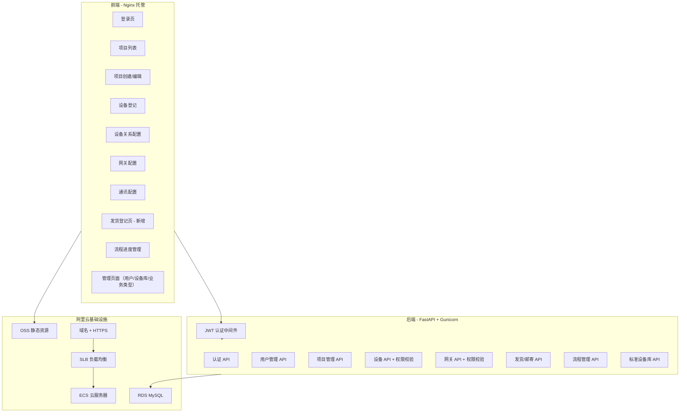
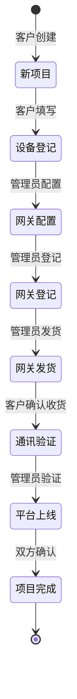

# 冷库项目管理系统 -- 云端部署开发规划

## 一、需求 vs 现状差距分析

### 已有基础（可复用）

- **数据库模型**：10 张表已定义完整（users, projects, cold_rooms, devices, device_relations, gateways, mailing_records, flow_records, equipment_brands, equipment_models）
- **项目管理 API**：CRUD + 数据隔离已实现（[backend/app/api/projects.py](backend/app/api/projects.py) 第 64-76 行有基于角色的权限查询）
- **用户管理 API**：增删改查 + 管理员权限校验已实现（[backend/app/api/users.py](backend/app/api/users.py)）
- **标准设备库 API**：完整的品牌/型号管理（[backend/app/api/equipment_library.py](backend/app/api/equipment_library.py)）
- **前端 17 个页面**：基本框架已搭建，含登录、项目管理、设备登记、网关配置等

### 需要开发/修复的部分

按您的 8 条需求逐一对照：

| 需求               | 现状                       | 差距                                   | 工作量 |
| ---------------- | ------------------------ | ------------------------------------ | --- |
| 1. 管理员管理账号       | users.py CRUD 已实现        | 缺少"编辑用户"前端功能                         | 小   |
| 2. 管理员管理设备分类     | equipment_library.py 已完成 | 前端 equipment-config.html 需完善         | 小   |
| 3. 管理员管理设备       | devices.py CRUD 已实现      | **缺少权限验证**，需添加角色校验                   | 中   |
| 4. 管理员管理网关及登记    | gateways.py CRUD 已实现     | **缺少权限验证**；gateway-config.html 是静态演示 | 中   |
| 5. 发货登记          | MailingRecord 模型+API 已实现 | **缺少发货登记前端页面**                       | 大   |
| 6. 用户建立项目、填写设备组成 | 前端页面已有                   | 需确保所有前端页面传递认证信息                      | 中   |
| 7. 用户与管理员流程交互    | FlowRecord 模型+API 已实现    | 流程状态推进逻辑需完善，**前端流程交互 UI 需增强**        | 大   |
| 8. 不同用户数据隔离      | projects.py 已实现          | **devices.py、gateways.py 缺少权限验证**    | 中   |

---

## 二、整体架构（目标状态）

### 用户角色与操作权限矩阵

| 功能模块       | 客户(customer) | 管理员(admin) |
| ---------- | ------------ | ---------- |
| 创建/编辑自己的项目 | 可以           | 可以         |
| 查看自己的项目    | 可以           | 可以（看全部）    |
| 查看他人项目     | 不可以          | 可以         |
| 管理标准设备库    | 不可以          | 可以         |
| 管理网关       | 不可以          | 可以         |
| 发货登记       | 不可以          | 可以         |
| 管理账号       | 不可以          | 可以         |
| 查看/推进流程进度  | 可以（自己项目）     | 可以（所有项目）   |

### 项目流程状态机

---

## 三、分阶段开发计划

### P0 阶段：安全基础（必须先做）

**目标**：系统可以安全地供多人使用

1. **JWT 认证改造**
  - 文件：[backend/app/api/auth.py](backend/app/api/auth.py)
  - 将当前简单 SHA256 token 替换为标准 JWT（python-jose + passlib）
  - 添加 token 过期时间（建议 24 小时）
  - 创建统一的 `get_current_user` 依赖函数，替代当前的 `X-User-Role` / `X-Username` header 方式
2. **设备 API 权限补全**
  - 文件：[backend/app/api/devices.py](backend/app/api/devices.py)
  - 所有接口添加 `get_current_user` 依赖
  - 通过 project_id 反查项目归属，非管理员只能操作自己项目的设备
3. **网关 API 权限补全**
  - 文件：[backend/app/api/gateways.py](backend/app/api/gateways.py)
  - 同上，所有接口添加权限校验
  - 网关管理类操作（增删改）限管理员
4. **前端认证增强**
  - 文件：[demo/assets/js/api.js](demo/assets/js/api.js)
  - 401 响应自动跳转登录页
  - Token 过期提示
  - 所有页面添加登录状态检查（未登录自动跳转）

### P1 阶段：核心功能完善

**目标**：满足 8 条需求中的核心业务功能

1. **新增发货登记页面**
  - 新建 `demo/shipping-register.html`
  - 后端 API 已有（[backend/app/api/gateways.py](backend/app/api/gateways.py) 的 `/mailing/` 端点）
  - 功能：选择项目和网关 -> 填写快递信息（单号、快递公司、收件人）-> 记录发货 -> 客户查看物流状态
  - 仅管理员可创建发货记录，客户可查看
2. **流程交互增强**
  - 文件：[demo/project-detail.html](demo/project-detail.html) 的流程进度区域
  - 后端：[backend/app/api/gateways.py](backend/app/api/gateways.py) 的 `/flows/` 端点
  - 根据角色显示不同的操作按钮：
    - 客户可推进的步骤：设备登记完成、确认收货
    - 管理员可推进的步骤：网关配置、网关登记、发货、通讯验证、平台上线
  - 流程推进时自动记录操作人和时间
3. **网关配置页面重做**
  - 文件：[demo/gateway-config.html](demo/gateway-config.html)（当前是静态演示）
  - 接入真实 API，实现端口分配和 485 地址配置
  - 仅管理员可操作
4. **前端角色 UI 适配**
  - 所有页面根据 `userRole` 显示/隐藏管理员功能
  - 客户看不到：用户管理、设备库管理、网关管理入口
  - 侧边栏/导航栏动态渲染

### P2 阶段：体验优化与部署

**目标**：系统可正式上线运行

1. **用户管理增强**
  - 文件：[demo/user-management.html](demo/user-management.html)
  - 添加"编辑用户"功能（修改密码、角色）
  - 添加用户操作日志
2. **前端从 localStorage 模式迁移到纯 API 模式**
  - 移除所有 localStorage 数据存储逻辑
    - 所有数据操作统一走后端 API
    - 这是部署到云端的前提条件（多用户共享数据必须经过数据库）
3. **阿里云部署**
  - ECS：部署 FastAPI 后端（Gunicorn + Uvicorn workers）
    - RDS MySQL：替代当前 SQLite 开发数据库
    - Nginx：托管前端静态文件 + 反向代理后端 API
    - 域名 + HTTPS 证书配置
    - 数据库初始化脚本 + 管理员初始账号创建

---

## 四、关键改动文件清单

| 阶段  | 文件                            | 改动类型               |
| --- | ----------------------------- | ------------------ |
| P0  | `backend/app/api/auth.py`     | 重构（JWT）            |
| P0  | `backend/app/api/devices.py`  | 修改（加权限）            |
| P0  | `backend/app/api/gateways.py` | 修改（加权限）            |
| P0  | `demo/assets/js/api.js`       | 修改（401处理）          |
| P1  | `demo/shipping-register.html` | **新增**             |
| P1  | `demo/project-detail.html`    | 修改（流程交互）           |
| P1  | `demo/gateway-config.html`    | 重构（接入API）          |
| P1  | 所有 `demo/*.html`              | 修改（角色UI适配）         |
| P2  | `demo/user-management.html`   | 修改（编辑功能）           |
| P2  | 所有 `demo/*.html`              | 修改（移除localStorage） |
| P2  | `deploy/` 目录                  | **新增**（部署脚本）       |

---

## 五、风险点

1. **localStorage 迁移**：当前前端大量使用 localStorage 做数据缓存和 fallback，迁移到纯 API 模式需要逐页面改造，工作量较大
2. **JWT 改造**：认证方式变更后，所有前端页面的 API 调用头部信息需同步更新
3. **数据库迁移**：SQLite -> MySQL 需要跑 schema 迁移，确保数据类型兼容
4. **并发安全**：多用户同时操作同一项目时需考虑数据竞争（如流程推进）

